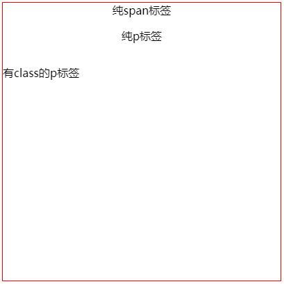

# 居中布局

## 水平居中

### `margin: 0 auto;`

在子元素上设定，适用于块级元素。

```html
<div class="wrapper">
  <div class="item"></div>
</div>
```

```css
.wrapper {
  width: 400px;
  height: 400px;
  border: 1px solid red;
}
.item {
  width: 100px;
  height: 100px;
  margin: 0 auto;
  background-color: black;
}
```

### `position: relative; margin: auto; left: 0; right: 0;`

  在子元素上设定，适用于块级元素。

```html
<div class="wrapper">
  <div class="item"></div>
</div>
```

```css
.item {
  width: 100px;
  height: 100px;
  position: relative;
  margin: auto;
  left: 0;
  right: 0;
  background-color: black;
}
```

### `text-align: center;`

在父元素上设定，其子元素中所有行内内容（如文字）居中，但不控制块元素的居中；当块元素中为行内内容，并且没有定位和宽高等影响属性，块元素中文本也会居中。

```html
<div class="wrapper">
  <span>纯span标签</span>
  <p>纯p标签</p>
  <p class="text-block">有class的p标签</p>
</div>
```

```css
.wrapper {
  width: 400px;
  height: 400px;
  text-align: center;
  border: 1px solid red;
}
.text-block {
  position: absolute;
}
```

效果图如下：



- `display: flex; justify-content: center;`，在父元素上设定，行内会转为块级。
- `display: grid; grid-template-columns: repeat(3, 100px); grid-template-rows: repeat(3, 100px); justify-items: center;`，在父元素上设定，行内会转为块级。

## 垂直居中

- `height` 与 `line-height` 属性值相等，在父元素上设定（适用于单行的行内元素：`inline` `inline-block`；多行会有行高问题）。
- `display: table-cell; vertical-align: middle;`，在父元素上设定。
- `display: flex; align-items: center;`，在父元素上设定，行内会转为块级。
- `display: grid; grid-template-columns: repeat(3, 100px); grid-template-rows: repeat(3, 100px); align-items: center;`，在父元素上设定，行内会转为块级。
- calc 计算

```css

```

## 水平垂直居中

- position: relative; top: 50%; left: 50%; margin: -150px 0 0 -250px;（已知 h:500px w:300px）
- position: absolute; top: 50%; left: 50%; transform: translate（-50%, -50%）;
